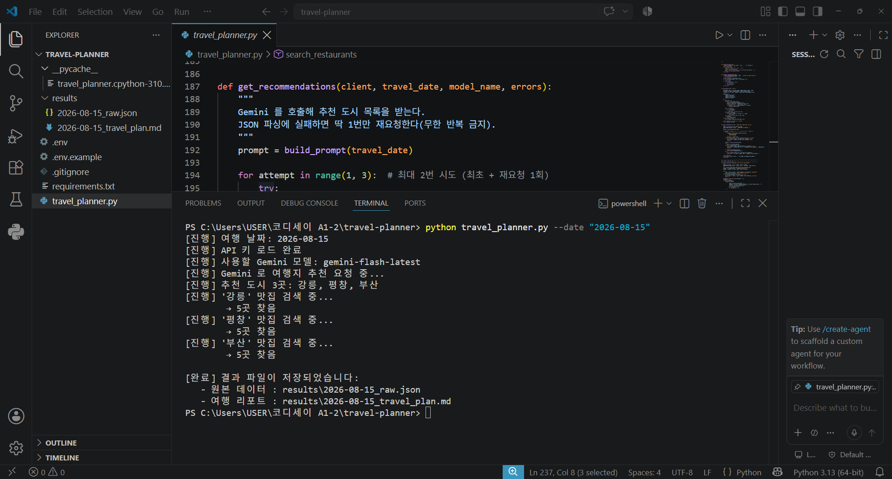
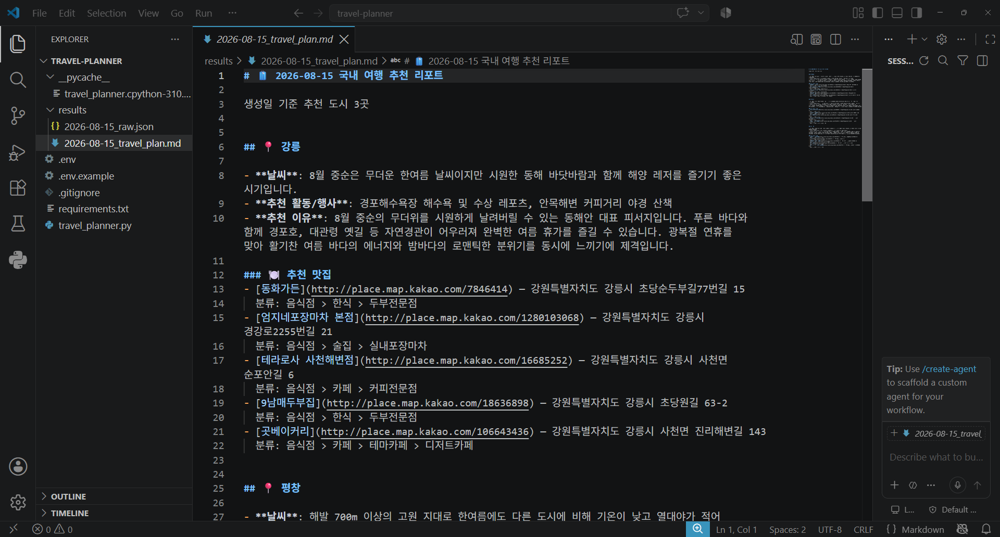

# 🧳 API 활용 국내 여행지 추천 프로그램

여행 날짜를 입력하면, **Google Gemini**가 그 시기에 어울리는 국내 여행 도시 2~3곳을 추천하고,
각 도시의 맛집을 **Kakao 로컬 API**로 찾아 하나의 여행 리포트로 정리해 주는 터미널(CLI) 프로그램입니다.

## 📌 주요 기능

- 여행 날짜(`--date`)를 입력받아 형식·유효성 검증
- Gemini로 국내 여행지 **복수 지역(2~3곳)** 추천 (날씨·추천 활동·추천 이유 포함)
- 추천된 각 도시마다 Kakao로 맛집 최대 5곳 검색 (이름·주소·분류·지도 링크)
- 결과를 **원본 JSON** + **읽기 좋은 Markdown 리포트**로 저장
- 외부 API가 실패해도 프로그램이 멈추지 않고 "데이터 없음"으로 계속 진행
- **결과 캐싱(보너스)** — 같은 날짜 재실행 시 API 호출을 생략하고 저장된 결과 재사용

## 🖼 실행 화면

**정상 실행 로그** — 도시 추천 후 도시별 맛집 검색까지 자동 진행



**최종 여행 리포트(Markdown)** — 지역별 추천 이유·날씨·맛집 정리



## 🗂 폴더 구조

```text
travel-planner/
├── travel_planner.py     # 메인 프로그램
├── requirements.txt      # 필요한 라이브러리 목록
├── README.md             # 사용 설명서 (이 파일)
├── .env                  # 실제 API 키 (Git에 올리지 않음)
├── .env.example          # 키 입력용 빈 템플릿 (공유용)
├── .gitignore            # .env 등 민감/불필요 파일 제외
├── results/              # 실행 결과(JSON·MD)가 저장되는 폴더
└── images/               # 보고서용 캡처 이미지
```

## 🛠 준비물

- Python 3.10 이상
- API 키 2개
  - **Gemini API 키** — [Google AI Studio](https://aistudio.google.com/apikey)에서 발급
  - **Kakao REST API 키** — [Kakao Developers](https://developers.kakao.com)에서 앱 생성 후 발급

## 🔑 API 키 발급 및 설정

### 1) Gemini 키

1. [Google AI Studio](https://aistudio.google.com/apikey) 접속 → 로그인
2. **Create API key** 클릭 → 생성된 키 복사
3. (참고) 최근 발급되는 키는 `AQ.`로 시작하는 새 형식이며 정상 동작합니다.

### 2) Kakao REST API 키

1. [Kakao Developers](https://developers.kakao.com) → **내 애플리케이션** → 앱 생성
2. **앱 → 플랫폼 키**에서 **REST API 키** 복사
3. ⚠️ **중요**: **제품 설정 → 카카오맵 → 사용 설정(상태)** 을 **ON**으로 켜야
   로컬(맛집) 검색이 동작합니다. (끄면 `403 Forbidden` 발생)

### 3) `.env` 파일에 키 입력

`.env` 파일을 열어 아래처럼 복사한 키를 넣습니다. (따옴표·공백 없이)

```env
GEMINI_API_KEY=발급받은_Gemini_키
KAKAO_REST_API_KEY=발급받은_Kakao_REST_API_키
```

## ▶️ 실행 방법

```bash
# 1) 라이브러리 설치 (최초 1회)
pip install -r requirements.txt

# 2) 실행 (날짜는 YYYY-MM-DD 형식)
python travel_planner.py --date "2026-08-15"

# 3) 같은 날짜를 강제로 다시 만들기 (캐시 무시하고 API 재호출)
python travel_planner.py --date "2026-08-15" --refresh

# 4) 캐시 유효 시간 지정 (예: 24시간 지난 결과는 새로 만들기)
python travel_planner.py --date "2026-08-15" --max-age-hours 24
```

정상 실행되면 아래처럼 진행 로그가 출력되고, 마지막에 결과 파일 위치를 알려줍니다.

```text
[진행] 여행 날짜: 2026-08-15
[진행] API 키 로드 완료
[진행] 사용할 Gemini 모델: gemini-flash-latest
[진행] 추천 도시 3곳: 강릉, 평창, 부산
[진행] '강릉' 맛집 검색 중...
        → 5곳 찾음
...
[완료] 결과 파일이 저장되었습니다:
   - 원본 데이터 : results/2026-08-15_raw.json
   - 여행 리포트 : results/2026-08-15_travel_plan.md
```

> 💡 계정마다 사용 가능한 Gemini 모델이 다르기 때문에, 프로그램이 실행 시
> 사용 가능한 모델을 **자동으로 선택**합니다. 모델 이름을 직접 고칠 필요가 없습니다.

## 📄 결과물 확인

실행이 끝나면 `results/` 폴더에 두 파일이 생깁니다.

- `YYYY-MM-DD_raw.json` — 추천 도시 + 도시별 맛집 + 처리 중 오류 기록이 담긴 원본 데이터
- `YYYY-MM-DD_travel_plan.md` — 사람이 읽기 좋은 최종 여행 리포트 (지역별 정리)

Markdown 파일은 VS Code의 **미리보기**로 열면 깔끔하게 렌더링되어 보입니다.

## 🧯 오류 처리 방식

프로그램은 잘못된 입력이나 외부 API 실패에도 안전하게 동작합니다.

| 상황 | 처리 방식 |
|---|---|
| 날짜 형식/유효성 오류 (예: `2026/08/15`, `2026-02-30`) | 안내 메시지 출력 후 종료 |
| API 키 누락 | 설정 방법 안내 후 종료 |
| Gemini JSON 파싱 실패 | **1회만** 재요청 — 이때 "순수 JSON만 출력하라"는 안내를 덧붙여 프롬프트를 보강 (무한 반복 방지) |
| Kakao 검색 실패 / 결과 0건 | 해당 도시는 "데이터 없음"으로 표시하고 계속 진행 |

## 🎁 보너스 과제 (2개 모두 수행)

과제지시서의 보너스 항목 **두 가지를 모두** 구현했습니다.

1. **복수 지역 추천** — 추천 도시를 1곳이 아니라 **2~3곳**으로 확장(`recommended_cities`)하고, 각 도시마다 맛집을 반복 검색하여 리포트에 **지역별로 정리**합니다. (반복 처리 + API 요청 관리 + 결과 구조 설계 경험)
2. **결과 캐싱** — 같은 `--date`로 재실행하면 저장된 원본 JSON을 재사용하여 **API 호출을 건너뛰고** 리포트만 다시 생성합니다. (외부 API 비용·속도 최적화 경험, `--refresh`로 강제 갱신)

## 📦 출력 데이터 스키마

원본 JSON(`results/{날짜}_raw.json`)의 구조입니다.

```json
{
  "schema_version": "1.0",
  "date": "2026-08-15",
  "recommended_cities": [
    {
      "city": "강릉",
      "weather": "이 시기의 날씨 요약",
      "events": ["행사/활동 1", "행사/활동 2"],
      "reason": "추천 이유 2~4문장",
      "restaurants": [
        { "name": "...", "address": "...", "category": "...", "url": "...", "x": "127.0", "y": "37.0" }
      ]
    }
  ],
  "errors": []
}
```

**필드 타입(필수/선택)**

| 키 | 타입 | 필수 | 설명 |
|---|---|---|---|
| `schema_version` | string | 필수 | 결과 형식 버전(파싱 호환성 관리용) |
| `date` | string | 필수 | 여행 날짜 `YYYY-MM-DD` |
| `recommended_cities[].city` | string | 필수 | 도시명 |
| `recommended_cities[].weather` | string | 필수 | 날씨 요약 |
| `recommended_cities[].events` | string[] | 선택 | 행사/활동 후보 |
| `recommended_cities[].reason` | string | 필수 | 추천 이유 |
| `recommended_cities[].restaurants[]` | object[] | 선택 | 맛집(name·address·category·url·x·y) |
| `errors` | string[] | 필수 | 처리 중 문제 기록(빈 배열 가능) |

> 과제 **기본 스키마**는 단일 도시(`recommended_city`)이지만, 본 프로젝트는 **보너스(복수 지역 추천)**를 반영해 이를 리스트 형태의 `recommended_cities`로 확장했습니다. 코드(`build_prompt`, `check_recommendation`)와 이 문서 모두 동일하게 `recommended_cities`를 사용합니다.

**핵심 함수 계약(인터페이스)** — 다른 지도 제공자로 교체할 때 이 시그니처만 지키면 됩니다.

| 함수 | 입력 | 출력 |
|---|---|---|
| `search_restaurants(kakao_key, city, errors)` | 키·도시명·오류목록 | 맛집 dict 리스트(실패/0건이면 `[]`) |
| `get_recommendations(client, date, model, errors)` | Gemini 클라이언트·날짜·모델·오류목록 | 도시 dict 리스트 |
| `normalize_city(name)` | 도시명 문자열 | 정규화된 도시명 문자열 |

## 🌐 REST API 요청 방식 (HTTP 메서드)

| 호출 | 메서드 | 엔드포인트 | 이유 |
|---|---|---|---|
| Gemini 여행지 추천 | **POST** | `generativelanguage.googleapis.com` (google-genai SDK 내부) | 프롬프트 등 **본문 데이터를 담아 보내야** 하므로 |
| Kakao 맛집 검색 | **GET** | `https://dapi.kakao.com/v2/local/search/keyword.json` | 데이터를 **조회만** 하고 쿼리(`query`,`size`)로 충분하므로 |

- **GET** = 서버 자원을 **읽기**만 할 때(파라미터는 URL 쿼리로 전달). **POST** = 서버에 **데이터를 보내 처리**를 요청할 때(본문에 데이터를 담음).
- Kakao 인증은 요청 헤더 `Authorization: KakaoAK {REST_API_KEY}`로 키를 실어 보냅니다.

## 🔎 API 오류 디버깅: 401 vs 403

장소 검색 실패 시 상태 코드로 원인을 나눠 봅니다.

| 코드 | 의미 | 확인할 것 |
|---|---|---|
| **401 Unauthorized** | 인증 실패(키 자체 문제) | `.env`의 키 값 오타, 헤더 형식(`Authorization: KakaoAK ...`), 키 활성화 |
| **403 Forbidden** | 인증은 됐으나 권한 없음 | 카카오맵(로컬) API **사용 설정 ON**, 허용 IP/도메인 제한 |

확인 순서: ① 로그의 상태 코드 → ② 요청 헤더 `Authorization` 값 → ③ 카카오 콘솔 카카오맵 사용 설정 → ④ 호출 허용 IP. 본 프로그램은 이런 오류가 나도 해당 도시를 "데이터 없음"으로 처리하고 `errors`에 기록한 뒤 계속 진행합니다.

- **오류 카테고리 태그**: `errors` 항목은 원인별로 `[AUTH]`(인증/권한), `[NETWORK]`(네트워크/HTTP), `[PARSE]`(JSON 파싱)로 태그를 붙여 기록합니다. 401/403은 재시도해도 소용없어 즉시 포기하고, 그 외 네트워크 오류는 짧은 backoff(0.5초·1초)로 최대 2회 재시도합니다.
- **디버깅 로그 시 민감정보 마스킹**: 요청/응답을 로그로 남길 때는 키가 노출되지 않도록 `Authorization` 헤더 값을 반드시 마스킹하세요. (예: `KakaoAK ****`, Gemini 키는 앞 4자리만 남기고 `AQ.****`) 이 프로그램은 오류 로그에 키 값을 출력하지 않습니다.

## 🧭 설계 노트

- **지도 API 추상화** — 장소 검색은 `search_restaurants()` **한 함수로 분리**했습니다. 다른 지도 제공자(예: 네이버)로 교체하려면 이 함수 내부(요청 URL·헤더·응답 파싱)만 바꾸면 되고 나머지 흐름은 그대로 재사용됩니다.
- **도시명 정규화** — LLM이 준 도시명을 `normalize_city()`로 **괄호·쉼표 뒤 부가설명을 제거**한 뒤 검색합니다. (예: `강릉(경포대)` → `강릉`)
- **재요청 시 프롬프트 보강** — Gemini 응답이 올바른 JSON이 아니면 **1회** 재요청하며, 이때 "순수 JSON만 출력하라"는 안내를 프롬프트에 덧붙여 성공률을 높입니다.
- **결과 캐싱** — 같은 `--date` 재실행 시 `results/{날짜}_raw.json`을 재사용. `--refresh`로 강제 재호출하고, `--max-age-hours N`으로 **N시간 지난 캐시는 자동 갱신**(간단한 TTL)할 수 있습니다. (기본 만료 정책: 없음 — 파일 삭제 시 갱신)
- **네트워크 재시도** — Kakao 검색은 일시적 네트워크 오류에 짧은 backoff로 최대 2회 재시도합니다. 단, 401/403(인증·권한) 오류는 재시도해도 소용없어 즉시 "데이터 없음"으로 넘어갑니다.
- **데이터 없음 요약** — 리포트 상단과 실행 로그에 맛집이 0건인 도시 수를 요약해 표시합니다.

## 🔐 API 키 보안 주의사항

> ⚠️ **키가 노출되었다면? → 즉시 해당 서비스에서 키를 재발급(폐기 후 새로 생성)하세요.** 노출된 키는 되돌릴 수 없으므로, 코드/커밋/캡처 어디에도 실제 키가 없는지 반드시 확인합니다.

- 실제 키는 **`.env` 파일에만** 저장하며, 코드에 직접 쓰지 않습니다.
- `.gitignore`에 `.env`가 포함되어 있어 **GitHub에 키가 올라가지 않습니다.**
- 공유·제출 시에는 값이 비어 있는 `.env.example`만 올립니다.
- **운영 환경 권장** — 키는 환경변수 또는 시크릿 매니저로 주입하고, **정기적으로 회전(교체)**합니다. 키를 `.env`로 분리해 두면 코드 수정 없이 값만 바꿔 회전할 수 있습니다.
- 오류 로그나 디버깅 출력에 **키 값을 남기지 않습니다**(위 디버깅 섹션의 마스킹 참고).

## 🧩 사용 기술 요약

- **Python** (argparse, requests, json, datetime)
- **Google Gemini API** (`google-genai`) — 여행지 추천 생성
- **Kakao 로컬 API** — 도시별 맛집 검색
- **python-dotenv** — API 키를 `.env`로 안전하게 분리
